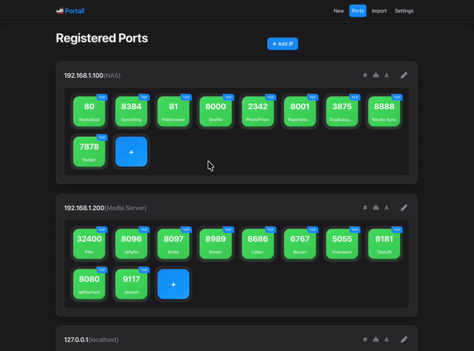
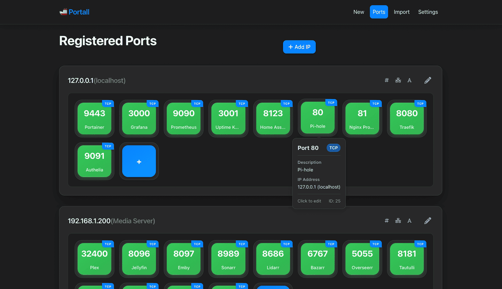

# 🚢 Portall - Port Management System


Portall provides an intuitive web-interface for generating, tracking, and organizing ports and services across multiple hosts.



## 🐳 Setup

### Quick Start (Build Image)
```bash
docker-compose up -d
```

### Quick Start (Pull Image)
```bash
docker-compose -f docker-compose.pull.yml up -d
```

### Environment
```bash
# Flask secret key for session security
- SECRET_KEY

# Docker API endpoint
- DOCKER_HOST

# Enable Docker integration features
- DOCKER_ENABLED

# Set this as the IP of your host. If unset will default to 127.0.0.1
- HOST_IP
```

## ✨ Core Functionality



**Easy Port Management**
   - Easily add, remove and assign ports to different hosts, with over 360 pre-defined services to choose from.

**Port Number Generation**
   - Quickly generate unique port numbers to host your applications.

**Robust Tagging System**
   - Create custom tagging rules for all your services, with built-in templates.

**Docker Integration**
   - Query ports directly from your Docker instance, with support for third-party tools like Portainer and Komodo.

**Port Scanning**
   - Setup automatic port scanning to add ports across various hosts.

**Import and Export Tools**
   - Import existing configurations, like your Caddyfile and docker-compose stack, and easily backup your setup using JSON.

**Docker Socket Proxy**
  - Uses a custom socket-proxy based off `11notes/socket-proxy:stable` for secure, read-only Docker API access

## 🎨 UI Goodies

**Block Level Design**
   - Drag and drop elements to easily organize your ports and move applications between hosts.

**Themes**
   - Ships with both Light and Dark modes, with more themes to come.

**CSS Playground**
   - Want to style the UI yourself? You can modify the look and feel via Custom CSS support.

**Mobile Responsive**
   - Manage your ports from anywhere with fully-responsive pages.

## 🛠️ Technical Stack

- 🐍 **Backend**: Flask 3.0.3 (Python 3.11)
- 💾 **Database**: SQLAlchemy 2.0.31 with SQLite
- 🔄 **Migrations**: Flask-Migrate 4.0.7 + Alembic 1.13.2
- 🐳 **Containerization**: Docker with secure socket proxy
- 🌐 **Frontend**: HTML5, CSS3, Vanilla JavaScript
- 🔗 **Integrations**: Docker API, Markdown rendering

