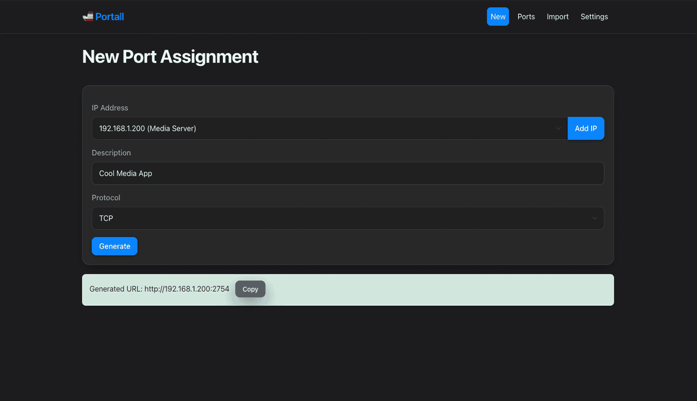

# 🚢 Portall - Port Management System


Portall provides an intuitive web-interface for generating, tracking, and organizing ports and services across multiple hosts.


## 🐳 Setup

### Docker Run

```bash
docker run -p 8080:8080 \
  -e SECRET_KEY=your_secret_key \
  -e PORT=8080 \
  -v ./instance:/app/instance \
  Portall
```

### Docker Compose
```yml
version: '3'
services:
  portall:
    image: need4swede/portall:latest
    container_name: portall
    ports:
      - "8080:8080"
    environment:
      - SECRET_KEY=your_secret_key
    volumes:
      - ./instance:/app/instance
```

## ✨ Core Functionality

**Easy Port Management**
   - Easily add, remove and assign ports to different services and hosts.

**Port Number Generation**
   - Quickly generate unique port numbers to host your applications.

**Import Tools**
   - Import existing configurations by pasting your Caddyfile, Docker-Compose or JSON data.

**Custom Rules**
   - Define your own port ranges and set exclusions for the port generator.

## 🎨 UI Goodies

**Block Level Design**
   - Drag and drop elements to easily organize your ports and move applications between hosts.

**Themes**
   - Ships with both Light and Dark modes, with more themes to come.

**CSS Playground**
   - Want to style the UI yourself? You can modify the look and feel via Custom CSS support.

**Mobile Responsive**
   - Manage your ports from anywhere with fully-responsive pages.

## 🛠️ Technical Stack

- 🐍 **Backend**: Flask (Python)
- 💾 **Database**: SQLAlchemy with SQLite
- 🌐 **Frontend**: HTML, CSS, JavaScript

## 📸 Screenshots

### Port Management


### Port Generator



### Import Tool


### Settings


